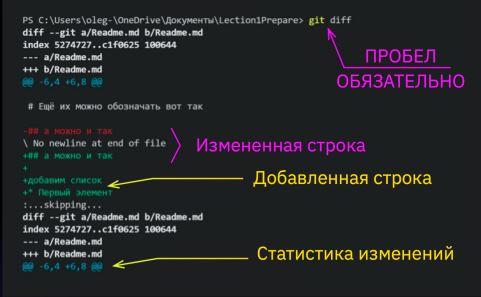

# Основные команды 1-ого Семинара
>*git init* - инициализация локального репозитория

> **git status** - получение информации о git текущем его состоянии

> __git log__ - получение информации о всех существующих commit (сохранениях)

С помощью команды *git log* :
1. Можно посмотреть уникальный номер (хеш код) каждого коммита
2. Можно узнать сведения о создателе, его контакты
3. Можно увидеть дату создания каждого коммита
4. Получить информацию о внесенных изменениях в исследуемом файле
> **__git add__** - добавляет содержимое рабочего каталога для коммита
Причем:
1. git add . - данной командой можно добавить все файлы в рабочем каталоге;
2. git add "fileName" - добавляет для коммита только определенный файл с указанным в команде именем.
3. При использовании клавиши TAB на клавиатуре после git add (и написать начало имене (2символа)) git может автоматически подтянуть нужное имя файла.
 > Команда *git checkout* - переключение между версиями.
Для работы нужно указать не только интересующий вас коммит, но и вернуться 
в тот, где работаем, при помощи команды 
git checkout master. (junior)

> Команда __git diff__
Показывает разницу между текущим файлом и сохранённым
Перед переключением версии файла в Git используйте команду git log, чтобы увидеть
количество сохранений

     *Синтаксис языка MarkDown*
      Жирный текст — *
 Курсивный текст — *

 Зачеркнутый текст — ~
 
 Выделяют заголовки — # в начале строки

Показать уровень заголовка —
подчеркивание знаками = или ****

Нумерованные Списки — обозначаются цифрами 1, 2, 3
 
 Ненумерованные Списки — обозначаются *знаками в начале строки
 
 Вложенные Списки — выполняем отступы
  
  __*Вся основная информация по git расположена по данной ссылке*__:
[Инструкция по пользованию git](https://habr.com/ru/articles/541258/)

# Основные команды 2-ого семинара

> Команда git commit -am - добавление файлов в отслеживание и создание коммита (заменяет две операнты: -a -m)

> *Команда git branch [branch_name]* - создать ветку под названием branch_name

git checkout <branch_name> – переход к другой ветке